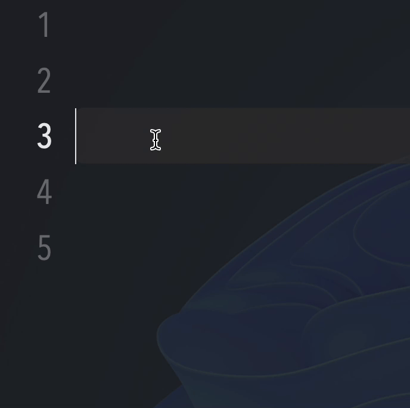
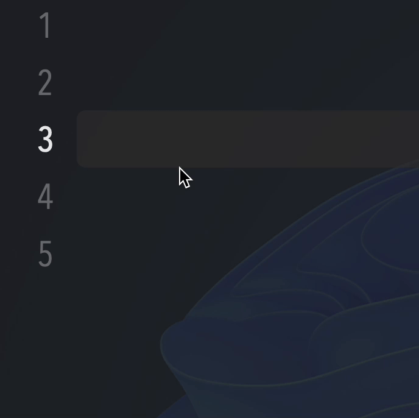

## Expander - simple snippet application for macos 10.15+

---

### Usage showcase

#### normal mode

#### passive mode

## 

#### extra - emoji snippets
> just type \cool (normal mode) and you will get 😎

### TODOs

#### key detection

- [x] remove sandbox for [AXIsProcessTrustedWithOptions]
- [x] handle CGEvent to detect key pressing

#### snippet

- [x] add
- [x] delete
- [x] edit
- [x] delete by pressing delete-key when tableview selection is available
- [x] change sort method
- [x] search snippets
- [x] passive mode

#### default snippets

- [x] date snippet
- [x] timestamp snippet
- [x] public IP snippet
- [x] private (local) IP snippet

#### UI design

- [x] toolbar that supports system under Big Sur (macos 11.0+)
- [x] statusbar menu
- [x] dynamic statusbar icon
- [x] hide dock icon

#### others

- [x] reload data when core data changed
- [x] temporarily disable expander
- [x] notification for toggling
- [x] optional expand-key for passive mode

#### Long Snippet with format
Expander will read the text files in specific directory and paste it.
---
### Dependencies
- [DSFQuickActionBar](https://github.com/dagronf/DSFQuickActionBar)
### More

#### [some swift tricks used in this project](./swift-tricks.md)
